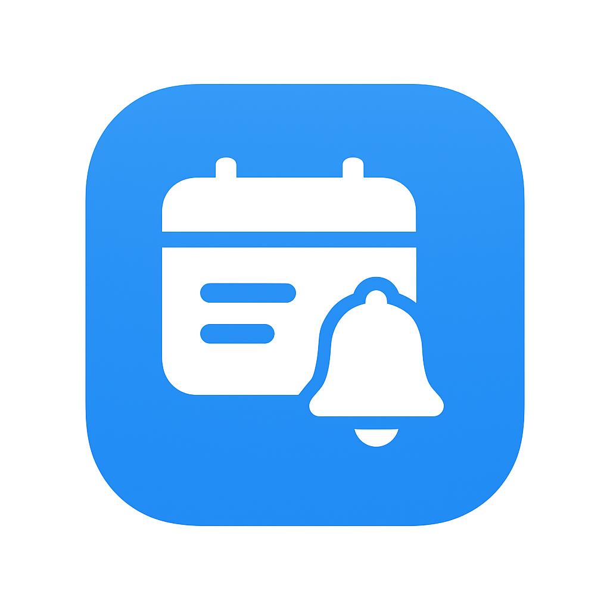

# Smart Timetable Reminder

<!-- Human-friendly intro -->
<p align="center">
  
</p>

> A timetable app I wished existed when I kept missing the *first 10 minutes* of classes. So I built it — minimal friction, smart reminders, exam mode, and a UI that actually feels nice on an AMOLED screen.

---

## Why This Exists
Juggling classes, labs, and surprise exam schedules can get messy fast. Calendar apps felt too generic. Note apps got cluttered. Alarm apps were dumb (either *too early* or *too late*). I wanted:
- A weekly view that stays focused
- “Heads up, class in X minutes” notifications that I can trust
- A way to flip into “exam mode” without deleting my normal timetable
- A design that doesn’t blind me at 6 AM

So this project became my solution — and now it’s yours too.

---

## ✨ Features

- 📅 **Class Timetable Management** – Organize weekly schedule fast
- 🔔 **Smart Notifications** – Pre-class + class start alerts with custom lead time
- 📚 **Exam Mode** – Separate exam timetable with automatic date-based switching
- ⚡ **Bulk Exam Generator** – Generate full exam schedules (duration, gaps, sessions)
- 🕒 **12h / 24h Time Support** – Flexible input & display
- 🧩 **Reusable Templates** – Subjects, time slots, exam presets
- 🎨 **AMOLED Dark UI** – Battery-friendly purple theme
- 🟣 **Live Now Highlighting** – See what’s currently in progress
- 💾 **Offline First** – Data stored locally (AsyncStorage)
- 🔐 **Privacy Respecting** – No accounts, no tracking

---

## 🖼️ Screenshots
> Add screenshots in `/assets/screenshots/` and reference them here.
```
assets/
  screenshots/
    schedule.png
    exam-mode.png
    add-class.png
```
Example (uncomment once added):
<!--
<p align="center">
  
  
  
</p>
-->

---

## 🚀 Quick Start

```bash
git clone https://github.com/theadhithyankr/Time-Table-Notifier.git
cd Time-Table-Notifier
npm install
npx expo start
```
Press: `a` (Android), `i` (iOS), or scan QR with Expo Go.

---

## 🧪 Usage Flow (Real Life Example)
> It’s Monday. 8:40 AM. You get a gentle ping: “Physics starting in 10 minutes.” You grab notes, fill your bottle, and walk in calm — not sprinting through the corridor. That’s the whole point.

1. Add classes once
2. Set lead time (5 / 10 / 15 min — your choice)
3. Forget about it — notifications handle the rest
4. When exam season approaches: toggle Exam Mode, generate schedule
5. After the end date, it slides back to normal automatically

## 🔔 Notifications You Actually Want
- Pre-class reminder: “<Subject> starting in X minutes”
- Start reminder: “<Subject> has started – ends at HH:MM”
- Uses platform channels (Android) for high priority

> For reliable delivery on device builds, use a physical device with permissions granted.

---

## 🧱 Tech Stack
- React Native (Expo)
- Expo Notifications
- AsyncStorage
- DateTimePicker
- EAS Build

---

## Human Touch & Philosophy
- No accounts, no tracking, no cloud lock-in.
- Local-first. Your data is *yours*.
- Designed to reduce anxiety, not add another productivity chore.
- Dark by default because battery + eyes matter.

## Roadmap (Shaping the Future)
| Idea | Status |
|------|--------|
| Home screen widget | Planned |
| Multi-semester profiles | Planned |
| Export / Import (JSON) | Planned |
| Optional sync (privacy-focused) | Exploring |
| Smart gap suggestions | Idea |

Have a feature dream? Open an issue — genuine suggestions are welcome.

## Contributing (Friendly Version)
If you’d like to polish, extend, or break things in a good way:
```bash
git checkout -b feature/your-idea
# build something small & focused
git commit -m "feat: add <short description>"
git push origin feature/your-idea
```
Then open a PR with a short summary + (screenshots if UI).

## FAQs
**Does it work offline?** Yes — everything is local.
**Will I lose data on update?** Not unless storage is cleared manually.
**Why not push notifications?** Local schedule = immediate + reliable.
**Can I make it sync across devices?** Not yet — intentional for simplicity.

## 🧾 License
MIT — do what you like. Attribution appreciated but not required.

## A Personal Note
If this helped you organize your semester or reduced morning chaos, that’s a win. Consider starring the repo so others can discover it.

---

### Crafted with care by **theadhithyankr**  
> “Stay ahead of your schedule — calmly.”

<p align="center"><sub>Feel free to fork, remix, and make it yours.</sub></p>